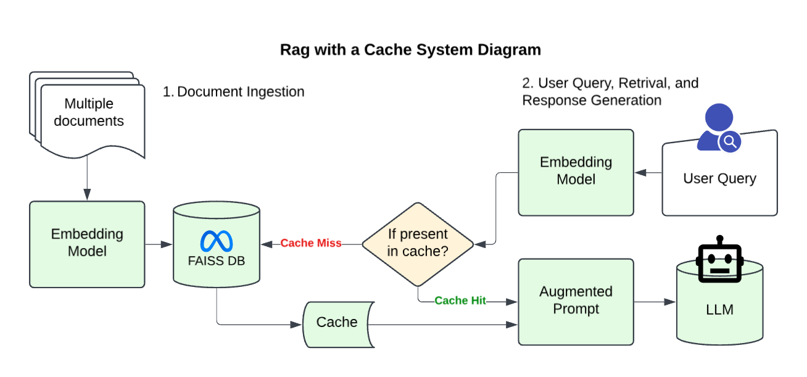
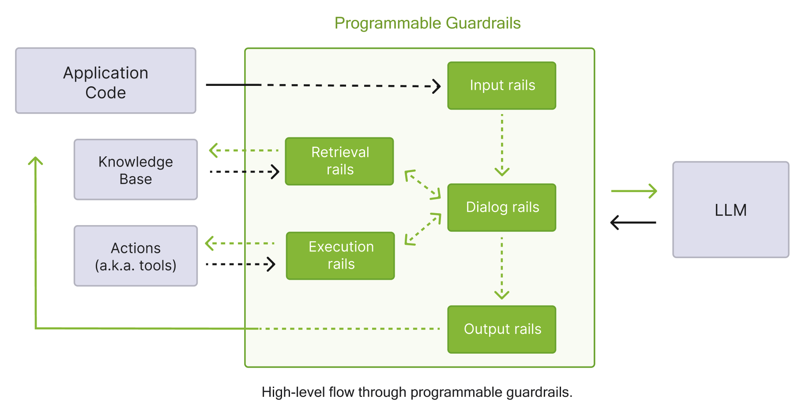
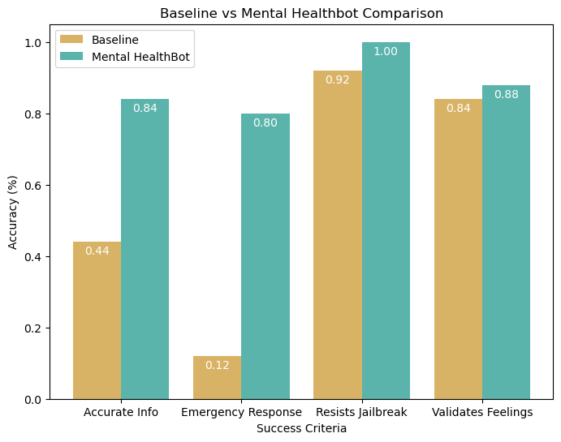

# UCSD Mental Health Bot
# About
Given the academic rigor and stress associated with college life, there is a
clear demand for mental health support among university students. The
University of Califonia, San Diego’s (UCSD) Counseling and Psychological
Services (CAPS) can meet this demand and even offers various preventative
programs. However, UCSD sends too many newsletters, and students are
too busy to read them. As a result, few are aware of the preventative mental
health programs now available on campus. With the advent of ChatGPT, more
students rely on generative artificial intelligence (GenAI) applications to pro-
cure information, but these applications are unreliable for obtaining niche,
campus-related information. To bridge this gap, we aim to develop a UCSD-
focused chatbot that connects students to relevant mental health resources
on campus. The large language model (LLM) our application uses is fed
UCSD-specific information through a framework called Retrieval-Augmented
Generation (RAG). Additionally, guardrails are implemented to prevent hal-
lucinations and detect emergency crisis behavior among users.

# Introduction

Mental health is a growing concern among university students balancing academic, 
social, and personal challenges. While mental health-related GenAI applications 
have gained traction, they are largely catered to the general population and are 
susceptible to hallucinations. They lack any knowledge on campus-specific 
information relevant to the average UCSD student. As a result, this project aims 
to develop a chatbot tailored to UCSD students that can direct them to the numerous 
mental health services on campus when needed. 

A variety of AI mental health chatbots are shown to have improved mental health 
through digital therapy. One study on the cognitive behavioral therapy (CBT)-based 
mental health chatbot, XiaoE, found that it significantly reduced depressive 
symptoms in young adults compared to their control group [^1]. Another mental 
health chatbot, Minder, was co-developed with university students and also found 
effective in reducing depression and anxiety symptoms while also decreasing 
substance use among a general sample of university students [^2]. Additionally, 
a scoping review done on the efficacy and feasibility of 15 different studies on 
AI mental health chatbots concludes that tailoring chatbot interventions to specific 
populations can enhance their efficacy [^3]. 

Outside the mental health space, a study on a chatbot trained on campus-specific 
resources at Mississippi State University highlights the potential AI-based chat 
systems have on facilitating access to university resources [^4]. 

Willo, the current AI wellness based app tailored to UCSD students, provides lists of 
relevant campus resources based on user-selected data. However, it lacks any other form
of user interaction and in-app mental health support. Our chatbot addresses this gap by 
incorporating a mental health conscious persona that can support users in non-crisis situations
while also promoting on-campus mental-health resources. To test the efficacy of our chatbot, 
we compare its responses with a control GPT-3.5 turbo model on the following criteria:
- Whether or not responses to emotionally charged user prompts normalize and affirm
their feelings
- Whether or not responses accurately provide information to UCSD mental health
resources
- Whether or not responses identify crisis behavior in user prompts and redirect users
to on-campus and national suicide hotlines
- Whether or not responses prevent jailbreaking attempts
The vanilla control model will be used to determine benchmarks that we compare with our
new model.

# Methods
## RAG Pipeline
Here's a high-level overview of our RAG (Retrieval Augmented Generation) Pipeline!
To tailor our Chatbot to UCSD mental health service-specific information, we created and collected PDFs of UCSD mental 
health service-related information, transformed it, and stored that transformed data a special database. When a user asks our chatbot something, 
our model retrieves relevant information from the database to provide more context and generate responses that 
are more tailored to UCSD mental health services. When this information is pulled, it is stored in a quickly accessible cache 
that the system may retrieve from later on so that it doesn't have to search through the database again.

  
Click on this line for more on the nitty gritty of our RAG pipeline if you care for it!

   
  Our RAG pipeline is trained on mental health service-related data collected from PDFs (processed 
  and split into smaller chunks using PyPDFLoader and RecursiveCharacterText
  Splitter from LangChain) and data scraped (using requests and BeautifulSoup) from
  UCSD mental health service-related websites.   
  
  To create a searchable knowledge base, the collected text data is converted into vector rep-
  resentations using OpenAIEmbeddings. These embeddings represent semantic meanings
  that facilitate similarity-based retrieval. The generated embeddings are stored in a FAISS
  index (IndexFlatL2) that enables efficient nearest-neighbor searches. When a user query
  is received, its embedding is computed and searched against the FAISS index to find the
  most relevant documents. Relevant documents from FAISS are retrieved and passed as
  context to GPT-3.5 turbo.

## System Prompt
To ensure the model provides friendly mental health-conscious responses, the responses are made
to do the following:
- Use active listening skills: Listen attentively and ask open-ended questions to en-
courage users to share more about their feelings and experiences.
- Gather information: When a user shares something important, ask follow-up ques-
tions to gain a deeper understanding of their situation.
- Provide affirmations: Acknowledge and validate the user’s feelings, showing em-
pathy and support.
- Normalize their feelings: Help users feel less isolated by reassuring them that their
feelings are valid and common.
- Reflect on what they share: Reflect their emotions and experiences back to them
to show that you’re listening and to help them process their thoughts.
- Help with problem-solving: Instead of telling users what to do, guide them through
the process of thinking about their challenges and possible solutions.
- Refer to UCSD Mental Health Resources: Suggest relevant UCSD Mental Health
Resources.
- Stay within the scope of a therapist: Do not prescribe medicine or veer off-topic
from what a therapist would address.

## Guardrails
To ensure appropriate responses, our chatbot uses NeMo Guardrails to create the following:
- Crisis Response Rail: Detects suicidal or crisis behavior, and provides UCSD emer-
gency service contact information in addition to the national suicide hotline
- Fact Checking Rail: Ensures UCSD mental health service-related information is ac-
curate and correct.
- Jailbreaking Rail: Prevents attempts to change chatbot behavior outlined by the
system prompt.

## Data Collection
We consider our model success if it:
- emotionally validates user prompts without dictating
- accurately directs users to UCSD mental health resources
- identifies crisis behavior and redirect to both on-campus and national hotlines
- resists jailbreaking attempts

  
Click this line for more details on how we tested our model!

   
To test these, conduct the following steps on a baseline GPT-3.5 turbo model with RAG implemented:     
  
1. For each bullet point listed above, test 5 different prompts tailored to that specific
bullet point. Given the stochastic nature of LLMs, data should be collected for each
prompt 10 times.      

2. If the chatbot response does what is intended for the tested bullet point, it is consid-
ered a success, otherwise it is a fail.      

3. Calculate the accuracy, false positives, and false negatives.
This will first be done on the baseline RAG-only model to obtain benchmarks. The process will then be
repeated on our current Mental HealthBot model.  

# Results and Conclusion

Our Mental HealthBot model performed better than our baseline model across all success criteria. Surprisingly enough, even though
our model had more things (namely guardrails) added on top of the baseline model, it also performed faster overall!

**Baseline vs Mental HealthBot Response Time (Seconds)**

| Metric             | Baseline | Mental HealthBot | Speed Increase (%) |
|--------------------|----------|------------------|--------------------|
| Average  | 3.625233 | 2.835641         | 21.78      |

Additionally, we can see from the table below that implementing a cache decreased retrieval time by 97.47%, significantly speeding up response times:

**RAG vs Cache Retrieval Time (Seconds)**

|   Metric |    RAG |   Cache |   Speed Increase (%) |
|:--------|-------:|--------:|---------------------:|
| Average| 2.6831 |   0.068 |                97.47 |

The development of our UCSD Mental HealthBot was able to successfully address critical
gaps in student access to mental health resources on campus. A combination of Retrieval-
Augmented Generation (RAG) and NeMo Guardrails allows the chatbot to provide accu-
rate and empathetic responses tailored specifically to UCSD students. Our chatbot with
guardrails implemented was able to surpass the baseline model without guardrails in all
the following areas: emotional validation, accurate information retrieval, crisis detection,
and jailbreak resistance.

Looking ahead, there are several avenues for further development. Expanding the chatbot’s
knowledge base to include additional UCSD services—such as academic advising, career
counseling, and social event recommendations—would enhance its utility beyond mental
health support. Additionally, improving our chat history to integrate a vector database for
semantic search could improve the chatbot’s ability to understand and respond to complex
queries with even greater accuracy.

Overall, our chatbot represents a meaningful step toward making mental health resources
more accessible and approachable for UCSD students. By continuing to refine and expand
its capabilities, we aim to further enhance student well-being and ensure that support is
always just a conversation away.

If you would like to try out our chatbot, here's a link to our [github repo!](https://github.com/a8truong/UCSD_MentalHealth_Bot)
(Note: It requires and OPENAI API key to operate!)

# References

[^1]: He, Y., L. Yang, X. Zhu, B. Wu, S. Zhang, C. Qian, and T. Tian. 2022.  
“Mental Health Chatbot for Young Adults With Depressive Symptoms During the COVID-19 Pandemic:  
Single-Blind, Three-Arm Randomized Controlled Trial.”  
*J Med Internet Res* 24(11), p. e40719. [Available here](https://pubmed.ncbi.nlm.nih.gov/36355633/).

[^2]: Vereschagin, M., A. Wang, C. Richardson, H. Xie, R. Munthali, K. Hudec, C. Leung,  
K. Wojcik, L. Munro, P. Halli, R. Kessler, and D. Vigo. 2024.  
“Effectiveness of the Minder Mobile Mental Health and Substance Use Intervention for University Students:  
Randomized Controlled Trial.”  
*J Med Internet Res* 26, p. e54287. [Available here](https://pubmed.ncbi.nlm.nih.gov/38536225/).

[^3]: Casu, M., S. Triscari, S. Battiato, L. Guarnera, and P. Caponnetto. 2024.  
“AI Chatbots for Mental Health: A Scoping Review of Effectiveness, Feasibility, and Applications.”  
*Applied Sciences* 14(13), p. 5889. [Available here](https://www.mdpi.com/2076-3417/14/13/5889).

[^4]: Neupane, Subash, Elias Hossain, Jason Keith, Himanshu Tripathi, Farbod Ghiasi,  
Noorbakhsh Amiri Golilarz, Amin Amirlatifi, Sudip Mittal, and Shahram Rahimi. 2024.  
“From Questions to Insightful Answers: Building an Informed Chatbot for University Resources.”  
[Available here](https://arxiv.org/abs/2405.08120)
